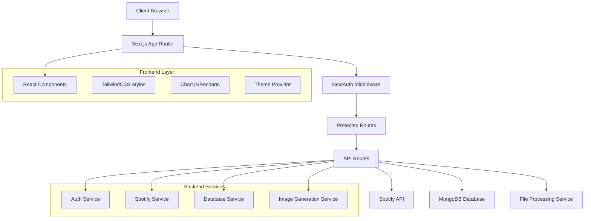

# Design Document

## Overview

El Spotify Dashboard es una aplicación web moderna que combina la potencia de Next.js 14 con App Router, TypeScript para type safety, y TailwindCSS para un diseño glassmorphism elegante. La arquitectura sigue patrones de desarrollo modernos con separación clara de responsabilidades, autenticación segura mediante NextAuth, y almacenamiento eficiente en MongoDB.

La aplicación implementa un sistema de componentes reutilizables con efectos glassmorphism consistentes, manejo de estado optimizado, y integración completa con la API de Spotify para obtener estadísticas en tiempo real y datos históricos.

## Architecture

### High-Level Architecture



### Technology Stack

- **Frontend**: Next.js 14 (App Router), React 18, TypeScript
- **Styling**: TailwindCSS con plugins para glassmorphism
- **Authentication**: NextAuth.js con Spotify Provider
- **Database**: MongoDB con Mongoose ODM
- **Charts**: Recharts para gráficas interactivas
- **Image Generation**: Canvas API o Puppeteer para compartir estadísticas
- **State Management**: React Context + useReducer para estado global
- **File Processing**: Multer para subida de archivos

## Components and Interfaces

### Core Components

#### 1. Layout Components
```typescript
// components/layout/GlassContainer.tsx
interface GlassContainerProps {
  children: React.ReactNode;
  className?: string;
  blur?: 'sm' | 'md' | 'lg';
  opacity?: number;
}

// components/layout/Navigation.tsx
interface NavigationProps {
  user?: User;
  theme: 'light' | 'dark';
  onThemeToggle: () => void;
}
```

#### 2. Dashboard Components
```typescript
// components/dashboard/StatsCard.tsx
interface StatsCardProps {
  title: string;
  value: string | number;
  icon: React.ReactNode;
  trend?: {
    value: number;
    isPositive: boolean;
  };
}

// components/dashboard/TimeRangeSelector.tsx
interface TimeRangeSelectorProps {
  selected: 'short_term' | 'medium_term' | 'long_term';
  onChange: (range: TimeRange) => void;
}

// components/dashboard/TopTracksChart.tsx
interface TopTracksChartProps {
  tracks: SpotifyTrack[];
  timeRange: TimeRange;
}
```

#### 3. Authentication Components
```typescript
// components/auth/LoginButton.tsx
interface LoginButtonProps {
  provider: 'spotify';
  callbackUrl?: string;
}

// components/auth/ProtectedRoute.tsx
interface ProtectedRouteProps {
  children: React.ReactNode;
  fallback?: React.ReactNode;
}
```

### Data Models

#### User Model
```typescript
interface User {
  id: string;
  spotifyId: string;
  email: string;
  displayName: string;
  images: SpotifyImage[];
  country: string;
  followers: number;
  product: 'free' | 'premium';
  preferences: UserPreferences;
  privacy: PrivacySettings;
  createdAt: Date;
  updatedAt: Date;
}

interface UserPreferences {
  theme: 'light' | 'dark' | 'system';
  defaultTimeRange: TimeRange;
  favoriteChartType: 'bar' | 'pie' | 'line';
}

interface PrivacySettings {
  publicProfile: boolean;
  showTopTracks: boolean;
  showTopArtists: boolean;
  showGenres: boolean;
  showListeningTime: boolean;
}
```

#### Spotify Data Models
```typescript
interface SpotifyTrack {
  id: string;
  name: string;
  artists: SpotifyArtist[];
  album: SpotifyAlbum;
  duration_ms: number;
  popularity: number;
  preview_url?: string;
  external_urls: {
    spotify: string;
  };
}

interface SpotifyArtist {
  id: string;
  name: string;
  genres: string[];
  popularity: number;
  followers: {
    total: number;
  };
  images: SpotifyImage[];
}

interface ListeningHistory {
  userId: string;
  trackId: string;
  playedAt: Date;
  msPlayed: number;
  trackName: string;
  artistName: string;
  albumName: string;
}
```

#### Statistics Models
```typescript
interface UserStats {
  userId: string;
  timeRange: TimeRange;
  topTracks: SpotifyTrack[];
  topArtists: SpotifyArtist[];
  topGenres: GenreStats[];
  totalMinutes: number;
  totalTracks: number;
  averagePopularity: number;
  generatedAt: Date;
}

interface GenreStats {
  genre: string;
  count: number;
  percentage: number;
  topArtists: string[];
}
```

## Data Models

### Database Schema (MongoDB)

#### Users Collection
```javascript
{
  _id: ObjectId,
  spotifyId: String (unique),
  email: String,
  displayName: String,
  images: [{ url: String, height: Number, width: Number }],
  country: String,
  followers: Number,
  product: String,
  preferences: {
    theme: String,
    defaultTimeRange: String,
    favoriteChartType: String
  },
  privacy: {
    publicProfile: Boolean,
    showTopTracks: Boolean,
    showTopArtists: Boolean,
    showGenres: Boolean,
    showListeningTime: Boolean
  },
  createdAt: Date,
  updatedAt: Date
}
```

#### User Stats Collection
```javascript
{
  _id: ObjectId,
  userId: ObjectId (ref: Users),
  timeRange: String,
  topTracks: [SpotifyTrack],
  topArtists: [SpotifyArtist],
  topGenres: [GenreStats],
  totalMinutes: Number,
  totalTracks: Number,
  averagePopularity: Number,
  generatedAt: Date,
  expiresAt: Date // TTL index for cache invalidation
}
```

#### Listening History Collection
```javascript
{
  _id: ObjectId,
  userId: ObjectId (ref: Users),
  trackId: String,
  playedAt: Date,
  msPlayed: Number,
  trackName: String,
  artistName: String,
  albumName: String,
  source: String // 'api' or 'import'
}
```

## Error Handling

### Error Types and Handling Strategy

#### 1. Authentication Errors
```typescript
class SpotifyAuthError extends Error {
  constructor(message: string, public code: string) {
    super(message);
    this.name = 'SpotifyAuthError';
  }
}

// Error handling in API routes
export async function GET(request: Request) {
  try {
    const session = await getServerSession(authOptions);
    if (!session) {
      return NextResponse.json(
        { error: 'Unauthorized' }, 
        { status: 401 }
      );
    }
    // ... rest of the logic
  } catch (error) {
    if (error instanceof SpotifyAuthError) {
      return NextResponse.json(
        { error: error.message, code: error.code },
        { status: 401 }
      );
    }
    return NextResponse.json(
      { error: 'Internal server error' },
      { status: 500 }
    );
  }
}
```

#### 2. API Rate Limiting
```typescript
class RateLimitHandler {
  private static retryAfter: number = 0;
  
  static async handleSpotifyRequest<T>(
    requestFn: () => Promise<T>
  ): Promise<T> {
    try {
      if (this.retryAfter > Date.now()) {
        throw new Error('Rate limited, please wait');
      }
      
      return await requestFn();
    } catch (error) {
      if (error.status === 429) {
        this.retryAfter = Date.now() + (error.retryAfter * 1000);
        throw new Error(`Rate limited. Retry after ${error.retryAfter} seconds`);
      }
      throw error;
    }
  }
}
```

#### 3. File Processing Errors
```typescript
interface FileProcessingResult {
  success: boolean;
  processedRecords: number;
  errors: string[];
  warnings: string[];
}

class FileProcessor {
  static async processSpotifyExport(
    file: File
  ): Promise<FileProcessingResult> {
    const result: FileProcessingResult = {
      success: false,
      processedRecords: 0,
      errors: [],
      warnings: []
    };
    
    try {
      const data = JSON.parse(await file.text());
      
      if (!this.validateSpotifyExportFormat(data)) {
        result.errors.push('Invalid Spotify export format');
        return result;
      }
      
      // Process records...
      result.success = true;
      return result;
    } catch (error) {
      result.errors.push(`File processing failed: ${error.message}`);
      return result;
    }
  }
}
```

## Testing Strategy

### Testing Pyramid

#### 1. Unit Tests
- **Components**: Testing individual React components with React Testing Library
- **Utilities**: Testing helper functions and data processing logic
- **API Functions**: Testing individual API endpoint logic

```typescript
// __tests__/components/StatsCard.test.tsx
import { render, screen } from '@testing-library/react';
import { StatsCard } from '@/components/dashboard/StatsCard';

describe('StatsCard', () => {
  it('renders stats correctly', () => {
    render(
      <StatsCard 
        title="Top Tracks" 
        value={42} 
        icon={<div>icon</div>}
        trend={{ value: 15, isPositive: true }}
      />
    );
    
    expect(screen.getByText('Top Tracks')).toBeInTheDocument();
    expect(screen.getByText('42')).toBeInTheDocument();
  });
});
```

#### 2. Integration Tests
- **API Routes**: Testing complete API workflows with database interactions
- **Authentication Flow**: Testing NextAuth integration with Spotify
- **File Processing**: Testing complete file upload and processing pipeline

```typescript
// __tests__/api/stats.test.ts
import { GET } from '@/app/api/stats/route';
import { getServerSession } from 'next-auth';

jest.mock('next-auth');
jest.mock('@/lib/spotify');

describe('/api/stats', () => {
  it('returns user stats for authenticated user', async () => {
    (getServerSession as jest.Mock).mockResolvedValue({
      user: { id: 'user123' }
    });
    
    const request = new Request('http://localhost/api/stats?range=short_term');
    const response = await GET(request);
    const data = await response.json();
    
    expect(response.status).toBe(200);
    expect(data).toHaveProperty('topTracks');
    expect(data).toHaveProperty('topArtists');
  });
});
```

#### 3. E2E Tests
- **User Journeys**: Testing complete user workflows from login to dashboard
- **Cross-browser Testing**: Ensuring compatibility across different browsers
- **Performance Testing**: Measuring load times and responsiveness

```typescript
// e2e/dashboard.spec.ts
import { test, expect } from '@playwright/test';

test('user can view dashboard after login', async ({ page }) => {
  await page.goto('/login');
  await page.click('[data-testid="spotify-login"]');
  
  // Mock Spotify OAuth flow
  await page.waitForURL('/dashboard');
  
  await expect(page.locator('[data-testid="stats-grid"]')).toBeVisible();
  await expect(page.locator('[data-testid="top-tracks-chart"]')).toBeVisible();
});
```

### Performance Testing
- **Lighthouse CI**: Automated performance, accessibility, and SEO audits
- **Bundle Analysis**: Monitoring bundle size and optimization opportunities
- **Database Query Performance**: Ensuring efficient MongoDB queries

### Security Testing
- **Authentication Testing**: Verifying secure token handling and session management
- **Input Validation**: Testing file upload security and data sanitization
- **Privacy Controls**: Ensuring privacy settings are properly enforced